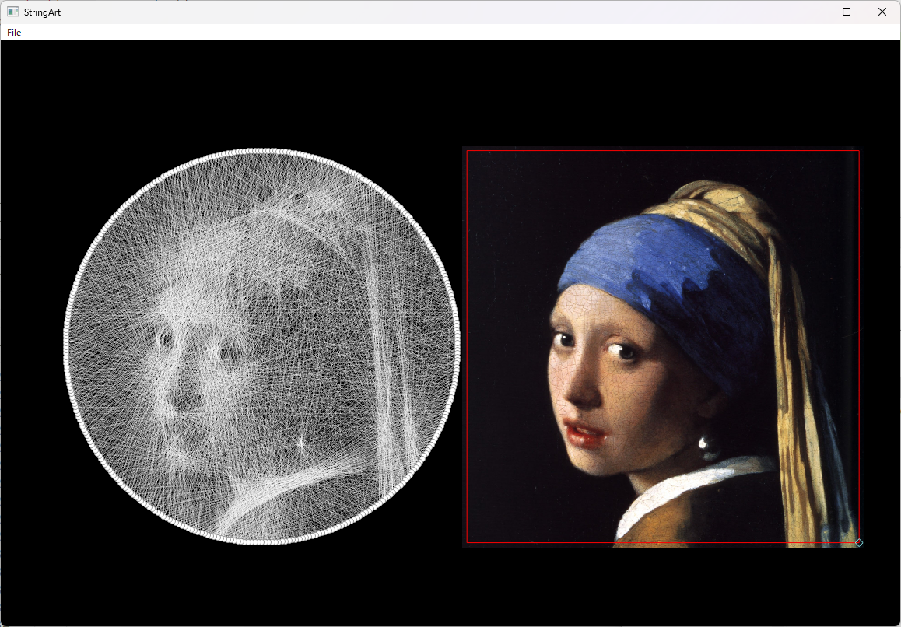

# StringArt_GUI
 Create String Art with PyQt
 

# Installaton
```
$ pip install PyQt5 pyqtgraph opencv-python tqdm
```

then just run StringArt.py

# How to use
Run StringArt.py.  
Open image from 'File'>'Open' menu.  
Write out Steps to text-file from 'File'>'Save steps' menu if you want.  

SPACE BAR: Calculate / Pause  
B: Change string color to Black  
W: Change string color to White  

The first run will take a few minutes; creating a cache file to store connections between nodes.